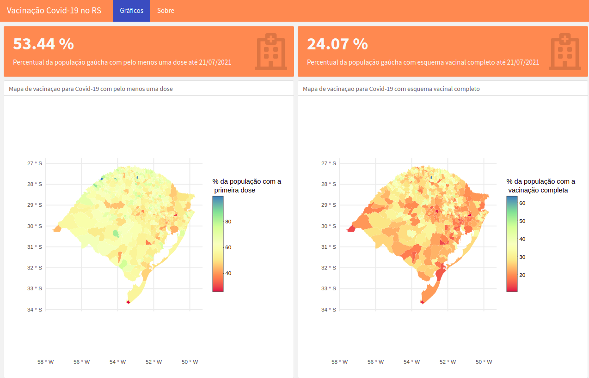

# Vacinação contra a Covid-19: alguns dados estatísticos, pela Sigma Jr.

Há alguns anos, dizia-se que a Estatística seria a profissão do futuro, e esse momento chegou. A cada ano que passa, mais fala-se do Estatístico ou Cientista de dados e faz-se necessário apoiar a tomada de decisão baseada em dados.

A estatística tem contribuído nas mais diversas áreas. Em tempos de pandemia a estatística tem sido utilizada constantemente para tomada de decisão. Por exemplo, na avaliação da eficácia de vacinas, no definição de quais grupos devem ser incluídos como prioridade para receber a vacina, e no constante monitoramento de leitos de Unidades de Terapia intensiva disponíveis.

Além disso, a parte de visualização de dados é empregada a fim de simplificar e comunicar informações de interesse da comunidade em geral. Há diversos tipos de gráficos que podem ser utilizados, dependendo do objetivo do trabalho determinado tipo de gráfico é preferível. Por exemplo, se queremos conhecer a distribuição do percentual da população com a primeira dose da vacina contra a Covid-19 nos municípios do Rio Grande do Sul (RS), uma forma de visualização adequada é o mapa.

A seguir ilustramos, em dois mapas, a distribuição do percentual da população do RS por município com a primeira dose e também com a imunização completa, registradas no site da Secretaria da Saúde do Estado do RS e disponíveis para acesso no site https://vacina.saude.rs.gov.br/. Os gráficos são construídos considerando dados que abrangem as vacinas aplicadas desde o início da campanha de vacinação até o dia 21/07/2021.  Com o objetivo de facilitar a visualização desses dados a Sigma Jr. desenvolveu um aplicativo que apresenta uma versão dinâmica dos mapas, permitindo verificar a situação de cada município apenas passando o mouse no mapa. Este aplicativo é um resultado da ação extensionista Sigma Aplica e está disponível no link https://sigmajr.github.io/COVIDRS/.

#### Dados estatísticos de vacinação contra a Covid-19 no Rio Grande do Sul.

Fonte: Elaborado pela Sigma Jr., a partir dos dados da Secretaria da Saúde do Estado do RS

Para esse período, tem-se que 50% dos municípios gaúchos já aplicaram a primeira dose em 58,7% da população. Por outro lado, 50% dos municípios gaúchos já possui 27,7% de sua população totalmente imunizada. Na Ciência Estatística, a medida que permite separar o banco de dados em duas partes para poder fazer esse tipo de verificação é denominada mediana. Desta forma, pode-se dizer que os valores medianos para os percentuais de imunização são 58,7% e 27,7% para a primeira dose da vacina e a imunização completa, respectivamente.

Ao verificar os valores máximos, que representam municípios com maior percentual da população vacinada, tem-se que o município de Porto Vera Cruz ficou em primeiro lugar no ranking da primeira dose, com 99,8% da população vacinada. O restante do pódio é composto por Engenho Velho e São José do Inhacorá, com percentuais de 97,8% e 91,4%, respectivamente. No caso da imunização completa, os municípios melhores classificados são Engenho Velho, com 63,8%, e empatados na segunda posição temos São José do Inhacorá e Barra do Rio Azul, ambos com 45,7%. Dentre os 496 municípios do RS, a cidade de Santa Maria encontra-se na posição 52 para a primeira dose e na posição 62, juntamente com o município de Vera Cruz, para a imunização completa.

#### Texto originalmente publicado em: https://www.ufsm.br/unidades-universitarias/ccne/2021/07/27/dadosvacinacaocovid19/
